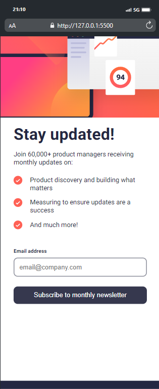
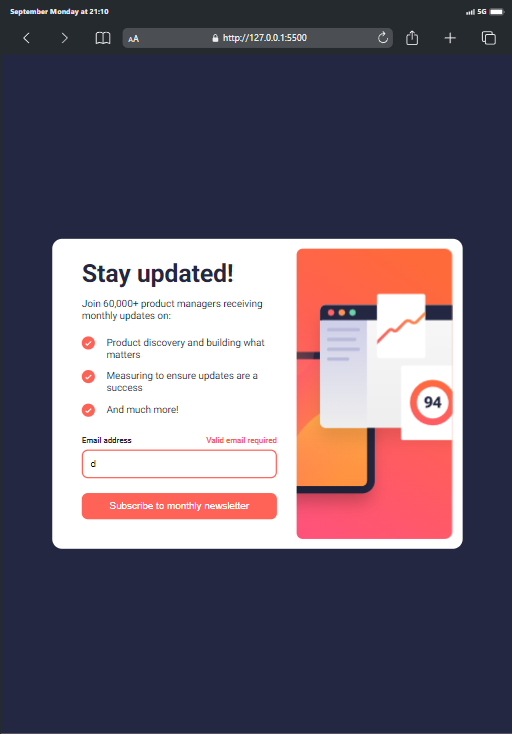
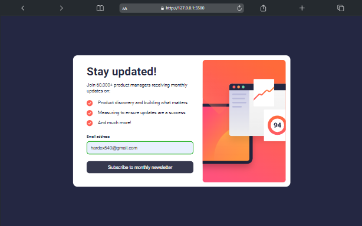

# Frontend Mentor - Newsletter sign-up form with success message solution

This is a solution to the
[Newsletter sign-up form with success message challenge on Frontend Mentor](https://www.frontendmentor.io/challenges/newsletter-signup-form-with-success-message-3FC1AZbNrv).
Frontend Mentor challenges help you improve your coding skills by building
realistic projects.

## Table of contents

- [Overview](#overview)
  - [The challenge](#the-challenge)
  - [Screenshot](#screenshot)
  - [Links](#links)
- [My process](#my-process)
  - [Built with](#built-with)
  - [What I learned](#what-i-learned)
  - [Continued development](#continued-development)
  - [Useful resources](#useful-resources)
- [Author](#author)
- [Acknowledgments](#acknowledgments)

## Overview

### The challenge

Users should be able to:

- Add their email and submit the form
- See a success message with their email after successfully submitting the form
- See form validation messages if:
  - The field is left empty
  - The email address is not formatted correctly
- View the optimal layout for the interface depending on their device's screen
  size
- See hover and focus states for all interactive elements on the page

### Screenshot







### Links

- Solution URL:
  [Add solution URL here](https://github.com/Mubarak-Adeyemi/newsletter-sign-up-with-success-message-main)
- Live Site URL:
  [Add live site URL here](https://mubarak-adeyemi.github.io/newsletter-sign-up-with-success-message-main/)

## My process

### Built with

- Semantic HTML5 markup
- CSS custom properties
- Flexbox
- CSS Grid
- Mobile-first workflow
- JS

### What I learned

This project helped me deepen my understanding of the following concepts:

#### Form validation and real-time feedback:

I learned how to implement real-time validation for user input by using the
input event listener. This provides immediate feedback to the user about whether
their input is valid or not, improving the overall user experience.

```js
emailInput.addEventListener("input", handleEmailInput);

const handleEmailInput = () => {
  const emailValue = emailInput.value;

  if (!validateEmail(emailValue)) {
    toggleClass(errorMessage, "visible", "hidden");
    toggleClass(emailInput, "invalid", "valid");
  } else {
    toggleClass(errorMessage, "hidden", "visible");
    toggleClass(emailInput, "valid", "invalid");
  }
};
```

The handleEmailInput function checks the email format as the user types and
dynamically updates the error message visibility and input field style.

#### Toggle class utility function:

I learned how to streamline the manipulation of CSS classes with a simple
utility function, making the code more modular and reducing repetition.

```js
const toggleClass = (element, classToAdd, classToRemove) => {
  element.classList.add(classToAdd);
  element.classList.remove(classToRemove);
};
```

This function makes it easy to manage class changes consistently throughout the
code.

#### Success message modal:

This project taught me how to handle the visibility of success messages using
CSS transitions and JavaScript. The modal appears once the user submits a valid
email, and they can dismiss it using a button.

```js
const handleFormSubmit = (e) => {
  e.preventDefault();

  if (validateEmail(emailInput.value)) {
    emailOutput.textContent = emailInput.value;
    toggleClass(formContainer, "hidden", "visible");
    toggleClass(successMessage, "visible", "hidden");
    emailInput.value = ""; // Clear the input after submission
  }
};
```

Here, the form hides and the success message shows, providing clear feedback for
a successful subscription.

### Continued development

While this project provided a strong foundation, there are several areas I'd
like to improve in future projects:

#### Enhanced Form Validation:

In the future, I'd like to handle more complex form validation, such as
validating multiple input fields (name, password, etc.), ensuring unique emails,
and providing custom error messages for different validation failures. Enhancing
the validateEmail function and adding multiple field validations would be a
useful challenge.

#### Accessibility:

Although I implemented basic aria-label attributes for screen readers, I want to
dive deeper into creating fully accessible forms by focusing on keyboard
navigation, semantic HTML, and ensuring that modals (like the success message)
are properly announced by screen readers.

#### Error Animation:

I'd like to add smooth animations for showing/hiding errors and success
messages. Right now, I toggle visibility, but adding animations (like fade-ins
and slide-outs) could improve the user experience.

### Useful resources

- [MDN Web Docs](https://developer.mozilla.org/en-US/) - I frequently referenced
  MDN for JavaScript methods, CSS properties, and accessibility guidelines.
  Their explanations of the input event, form validation, and ARIA attributes
  were especially helpful.

- [CSS Tricks](https://css-tricks.com/) - I used CSS Tricks for learning about
  CSS transitions and animations, which helped me create smoother UI
  transitions.

## Author

- Frontend Mentor - (https://www.frontendmentor.io/profile/Mubarak-Adeyemi)
- Twitter - (https://www.twitter.com/mubarakElarabiy)

## Acknowledgments

I would like to acknowledge:

- Frontend Mentor for providing the design inspiration and coding challenge,
  pushing me to improve my frontend development skills.
- MDN Web Docs for their exhaustive and clear documentation, which I referenced
  multiple times for JavaScript and CSS queries.
- CSS Tricks for their tutorials and tricks on how to improve and polish the
  visual aesthetics of the UI, especially with CSS transitions and animations.
- Google Fonts for providing the "Roboto" font used in the project to maintain a
  clean and modern look.
